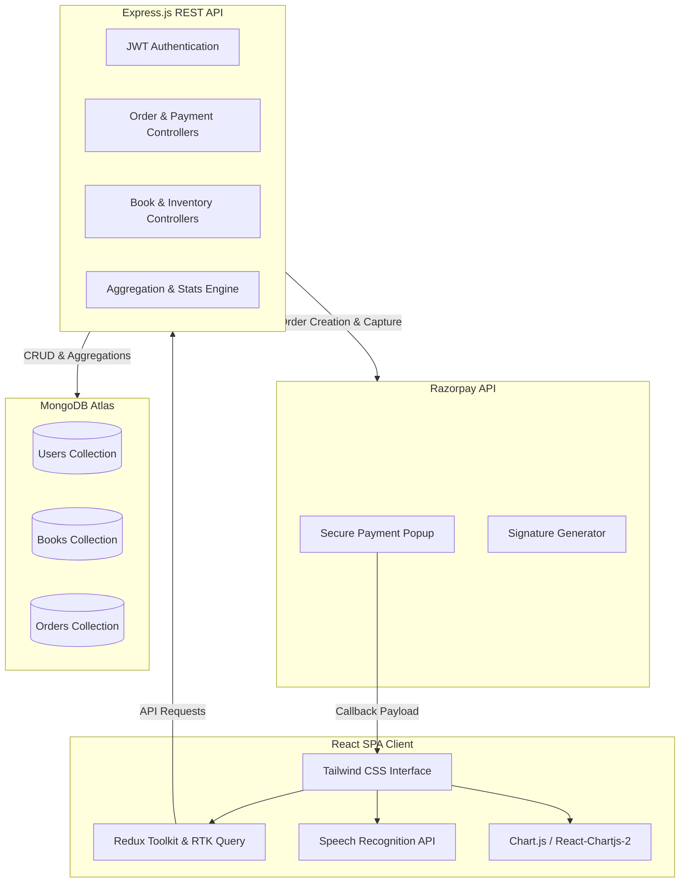

# 📚 Litsense Bookstore — AI-Powered Online E-Commerce Platform

[](https://reactjs.org/)
[](https://nodejs.org/)
[](https://www.mongodb.com/)
[](https://tailwindcss.com/)
[](https://redux.js.org/)

**Litsense Bookstore** is a state-of-the-art, full-stack MERN e-commerce application designed as an advanced Final Year Project. It bridges the gap between traditional online retail and cutting-edge interactive features by blending standard bookstore mechanics with AI Voice Search, mood-based discoveries, real-time payment processing, and corporate-level admin dashboards.

---

## 🗺️ System Architecture

The diagram below outlines the full-stack architecture of Litsense, illustrating how the React SPA communicates with the Express REST API, handles secure payment signatures, utilizes browser recognition, and stores transactional/inventory data:



---

## ✨ Core Features

### 🎙️ 1. AI Voice Search
* Powered by the native browser **Web Speech API** (`webkitSpeechRecognition`).
* Highly interactive: navbar search features a mic button that pulses red and prompts the user ("Listening... Speak now") when active.
* Automatically transcribes speech, populates the search bar, and executes a dynamic bookstore search.

### 🎭 2. AI Mood-Based Book Filtering
* Gamified reading selection! Readers can filter books dynamically by matching their current mood (e.g., Happy, Adventurous, Romantic, Suspenseful).
* Smoothly fetches tailored titles with custom styling themes appropriate for each reading mood.

### 💳 3. Razorpay Online Payment Gateway & COD
* Fully functional integration of the **Razorpay Payment Gateway SDK**.
* Secure **HMAC-SHA256 signature verification** on the backend to prevent payment tampering.
* Seamless **Rupees (₹) localization** across the entire storefront, checkout flow, and database models.
* Standard **Cash on Delivery (COD)** checkout toggle alongside secure online payments.

### 🚚 4. Interactive Order Tracking Timeline
* Visual stepper indicator displayed on the order panel for customers.
* Indicates exact processing state in real time: `Order Placed` ➔ `Processing` ➔ `Shipped` ➔ `Delivered`.

### 📊 5. Corporate Admin Analytics Dashboard
* **Revenue Overview**: Interactive, dynamic line chart (`chart.js`) plotting monthly sales with premium smooth curves and gradient fills.
* **Inventory Spread**: Custom Doughnut ring chart visualizing current inventory distribution across different book genres.
* **Order Status Processing**: Interactive dashboard enabling admins to update order statuses (e.g., Shipped, Delivered) in one click.
* **Inventory Manager**: Fully operational CRUD interface for adding, editing, and deleting catalog books.

---

## 🛠️ Technology Stack

| Layer | Technologies |
| :--- | :--- |
| **Frontend** | React (Vite), Redux Toolkit (RTK Query), Tailwind CSS, Chart.js, SweetAlert2, React Icons |
| **Backend** | Node.js, Express.js, JSON Web Tokens (JWT), Crypto |
| **Database** | MongoDB Atlas, Mongoose ODM |
| **APIs Used** | Razorpay Node SDK, Web Speech API |

---

## ⚙️ Installation & Setup Guide

### 📋 Prerequisites
Ensure you have **Node.js (v16+)** and **MongoDB** installed on your system.

### 1. Clone the Repository
```bash
git clone <repository-url>
cd BookStore_Project
```

### 2. Configure the Backend
Navigate to the `Backend` folder, install the dependencies, and set up your `.env` file:
```bash
cd Backend
npm install
```

Create a `.env` file inside the `Backend` folder:
```env
PORT=5000
DB_URL="your-mongodb-connection-string"
JWT_SECRET_KEY="your-jwt-secret"

# Razorpay Keys (Test Mode)
RAZORPAY_KEY_ID="your-razorpay-key-id"
RAZORPAY_KEY_SECRET="your-razorpay-key-secret"
```

Start the backend development server:
```bash
npm run start:dev
```

### 3. Configure the Frontend
Navigate to the `frontend` folder, install the dependencies, and start the development server:
```bash
cd ../frontend
npm install
npm run dev
```

Your application should now be fully operational locally!
* **Frontend Port:** `http://localhost:5173`
* **Backend Port:** `http://localhost:5000`

---

## 👤 Author
* **Tamanna** — Main Developer / Final Year Project Lead

---
*Developed with ❤️ as a modern, high-grade Academic Capstone Project.*
